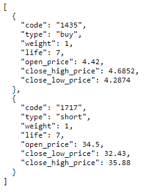
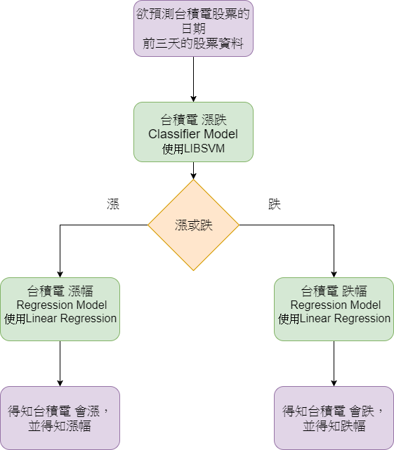

# MachineLearning_Stock_Prediction
Q36064010 陳昭成 Stock Prediction Supplementary Report
------------------------------------------------------

我在股票預測上專注於研究鴻海與台積電的股票預測，因此，我為這兩間公司打造其專屬的Model來做其專屬的股票預測。

我為這兩間公司分別訓練了三個models，分別為: 漲跌Classifier, 漲幅
Regressor, 跌幅 Regressor

#Program execution steps:

**Steps 1, Parse the desired stock history data from 台灣證券交易所**

**Parameters that you can modify :**

-   thisYear(e.g.,2017): to get the stock history data in 2017.

-   month\_list(e.g.,range(1,13) ): to get stock history data from
    January to December.

-   Id\_list(e.g., [‘2331’,’2330’]) : to put the stock numbers here if
    you want to parse their stock history data.
```
python3 getStock.py
```
**Step 2, Convert the parsed stock history data to the format that 漲幅
Regressor and 跌幅 Regressor can accept.**

**Parameters that you can modify :**

-   thisYear(e.g.,2017): to convert the stock history data in 2017 to
    the format that 漲幅 Regressor and 跌幅 Regressor can accept.

-   month\_list(e.g.,range(1,13) ): to convert stock history data from
    January to December to the format that 漲幅 Regressor and 跌幅
    Regressor can accept.

-   Id\_list(e.g., [‘2331’,’2330’]) : to put the stock numbers here if
    you want to convert their stock history data to the format that 漲幅
    Regressor and 跌幅 Regressor can accept.
```
python3 getStockTrainData.py
```
**Step 3, Convert the parsed stock history data and the output data from
Step 2 to the format that LIBSVM can accept.**

**Parameters that you can modify :**

-   Id\_list(e.g., [‘2331’,’2330’]) : to put the stock numbers here if
    you want to convert their stock history data to the format that
    LIBSVM can accept.
```
python3 libsvmTrainingData.py
```
**Step 4, Execute the parser program to parse the stock data of the
stock number specified in the getStockTestData.py every day**

**Parameters that you can modify :**

-   Id\_list(e.g., [‘2331’,’2330’]) : to put the stock numbers here if
    you want to parse their stock data every day after the stock market
    trade ends.
```
python3 getStockTestData.py
```
**Step 5, Train the漲幅 Regressor and 跌幅 Regressor:**

**Parameters that you can modify :**

-   Id\_list(e.g., [‘2331’,’2330’]) : to put the stock numbers here if
    you want to train **漲幅 Regressor and 跌幅 Regressor with** their
    stock history data.
```
python3 trainStockPredictionModel.py
```
**Step 6, Train the 漲跌Classifier, which is implemented by using
LIBSVM.**

Refer to the manual of
[*LIBSVM*](https://www.csie.ntu.edu.tw/~cjlin/libsvm/).

After finishing training, please put the model file (.scale) in the
"LIBSVMTestResult" folder.

**Step 7, Open another terminal to execute the stock prediction for
tomorrow and get the prediction result(this should be done after today’s
stock market trade ends)**

**Parameters that you can modify in predictStock.py:**

-   Id\_list(e.g., [‘2331’,’2330’]) : to put the stock numbers here if
    you want to predict their tomorrow stock performance(You must put
    all these stock number in the id\_list of the previous steps to
    achieve the prediction.).
```
sh run.sh
```
**Output Format:**



### Model 介紹:

**漲跌Classifier**: 用以預測輸入的測試資料是漲或是跌

**漲幅
Regressor**:若漲跌Classifier得出的結果是漲，則將輸入的測試資料輸入漲幅
Regressor來預測其漲幅。

**跌幅 Regressor**:
若漲跌Classifier得出的結果是跌，則將輸入的測試資料輸入跌幅
Regressor來預測其漲幅。

### 訓練資料說明:

以三天為單位，如2017/10/10的資料為:

2017/10/8, 2017/10/9,
2017/10/10三天的”開盤價,最高價,最低價,收盤價,漲跌價差,投信,自營商,外資”再加上2017/10/10當天的股價是漲或跌(RiseOrFall)來組成一筆訓練資料。

因此，輸入model的測試資料也是用這種模式去產生的，例如:要預測2017/12/31的漲跌，就會將2017/12/28,
2017/12/29,
2017/12/30三天的”開盤價,最高價,最低價,收盤價,漲跌價差,投信,自營商,外資”串接為一筆測試資料，去讓model產生出2017/12/31當天的股價是漲或跌(RiseOrFall)的輸出結果。

### 各Model訓練資料說明:

**漲跌Classifier**:

將欲預測的日期前三天的股票資訊合併並附上欲預測的日期當天的股票漲與跌標記。共蒐集了2016/1/1~2017/9/30的鴻海與台積電的股票資料，並分別作為其漲跌Classifier的訓練資料。


**漲幅 Regressor**:

將蒐集到的2016/1/1~2017/9/30的鴻海與台積電的股票資料中漲或跌(RiseOrFall)feature為漲的資料抽出，並加入其漲幅feature後，並分別作為其漲幅
Regressor的訓練資料。


**跌幅 Regressor**:

將蒐集到的2016/1/1~2017/9/30的鴻海與台積電的股票資料中漲或跌(RiseOrFall)feature為跌的資料抽出，並加入其跌幅feature後，並分別作為其跌幅
Regressor的訓練資料。


### Model實作架構:

在Model的實作上，我使用了兩種不同的Model來做股票的預測，分別使用了RandomForest與LIBSVM來作為漲跌Classifier

#### 使用RandomForest 作為漲跌Classifier的Stock Prediction Model Structure: 

因為在課堂上有聽到老師說明RandomForest 演算法中以含有Feature
Selection的功能，因此，在不確定訓練資料中哪些feature是真正對股價有較大影響的情況下，想以RandomForest
作為判斷測試資料漲跌的classifier，來以對股價有較大影響力的feature來預測該股價的漲跌。

得出該股價的漲跌後，再根據漲還是跌來將該測試資料以Linear
Regression來預測其漲幅或是跌幅。

#### 使用LIBSVM 作為漲跌Classifier的Stock Prediction Model Structure: 

#### 

因為在課堂上有聽到老師說明由台大發表的LIBSVM
在預測期貨上的表現比sklearn中提供的SVC
有更好的預測結果，因此，我便使用了 LIBSVM
來做為預測輸入資料漲還是跌的Model，並根據LIBSVM的訓練資料輸入格式需求，去改寫了產生訓練資料的程式，以符合LIBSVM訓練上的輸入與輸出格式需求。

也確實在使用了LIBSVM來取代RandomForest來判斷輸入資料漲還是跌後，表現確實有比以前出色。

#### 

讓我的股票預測結果(藍線)能11月期間有翻身贏過TA(黑線)與TAIE(黃線)。


